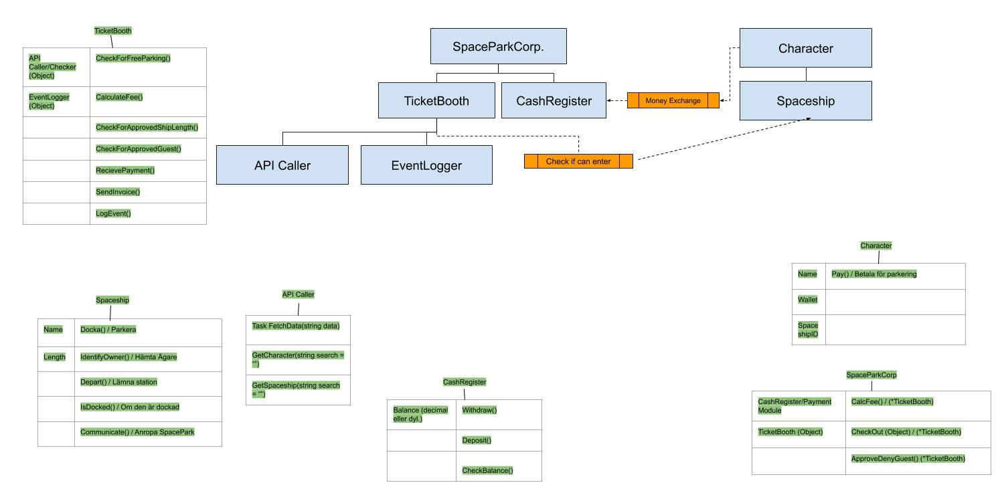
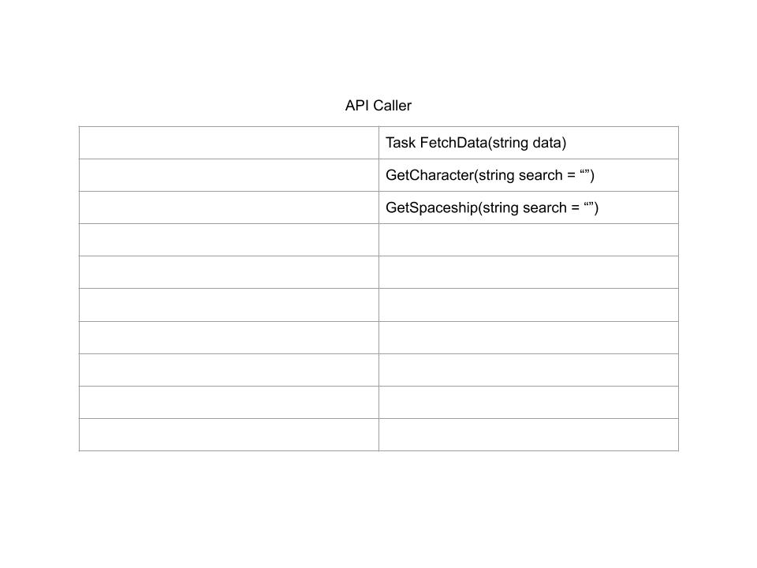
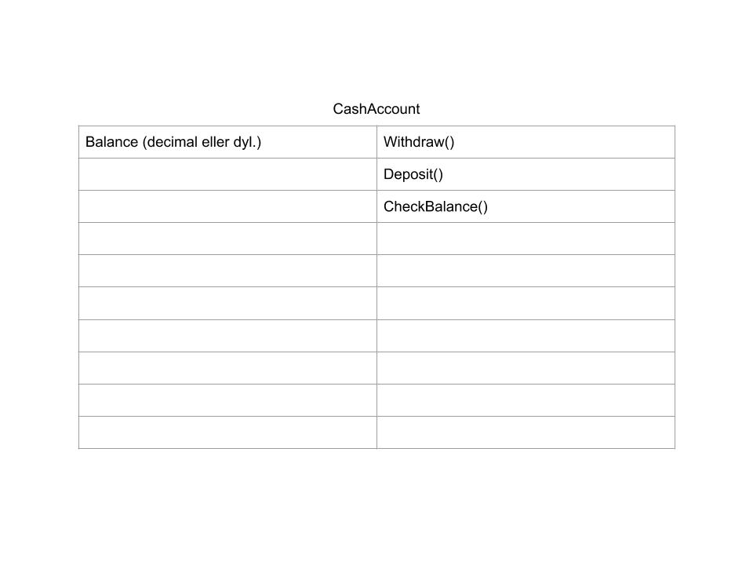
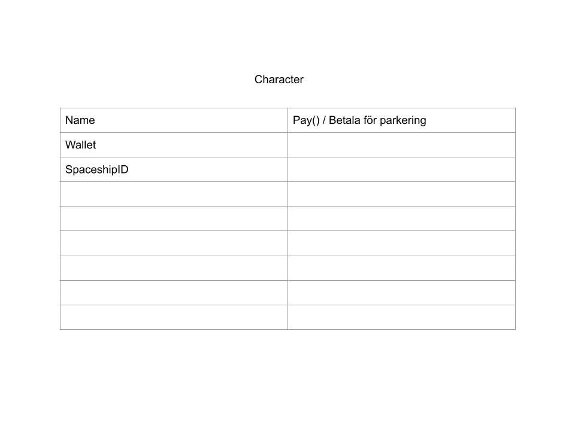
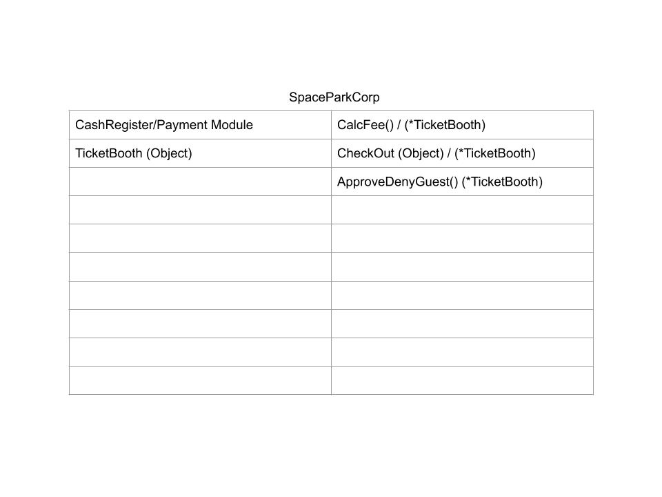
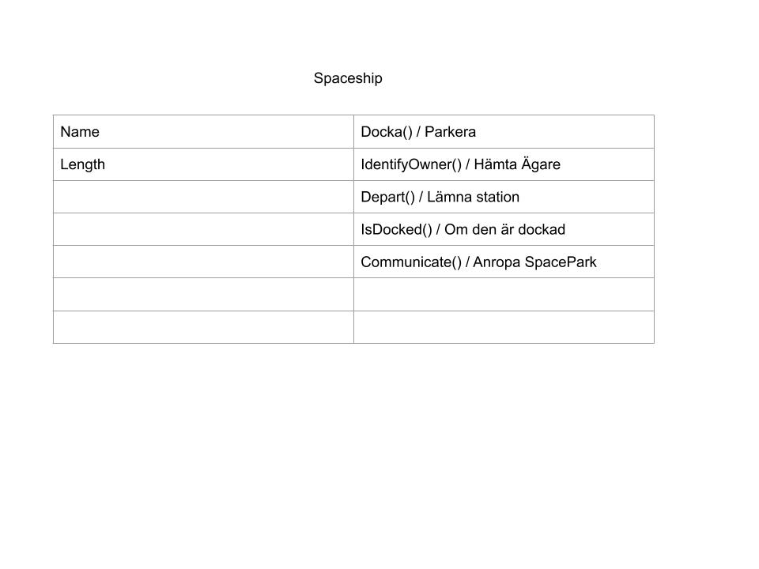
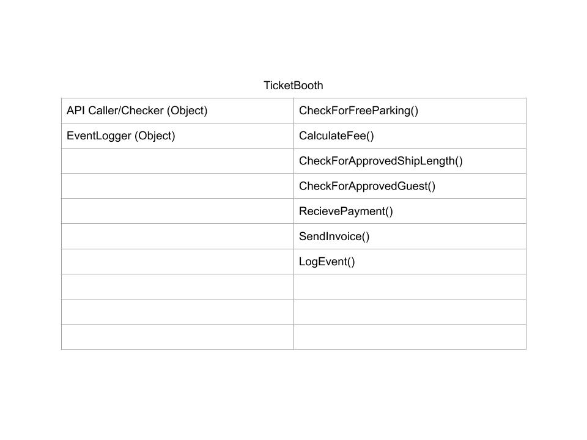

#the-spaceport-grupp-1
We have used drawings and documentation mainly in our planning phase 
and have later used that to remind us of where we are going with the 
different sections and pieces of the project.

This mindmap doesn't show how it all ended up our all of it but it gives
an idea of where we were going.

We also used CRC-cards to map out our classes in the beginning.

For a while we tried out having a todo-list to let everyone know what needs
to be done next. We didn't end up using it that much though.

We had a couple of rules stipulated at the beginning of the project 
to help us know what we had to think about when writing code or
working with the project in general.
.md)

We also have the beginnings of a git bash document which is meant to be a 
guideline for how our goup is supposed to work with git. It wasn't 
finished but we still looked at it from time to time to get help and 
ideas for a workflow using git and git bash.

We hit a bit of a wall in our projekt later on and we didn't end up 
all the way where we wanted to be. So we wrote down a few of the things
we thought are good for us to keep in mind for our next project.

